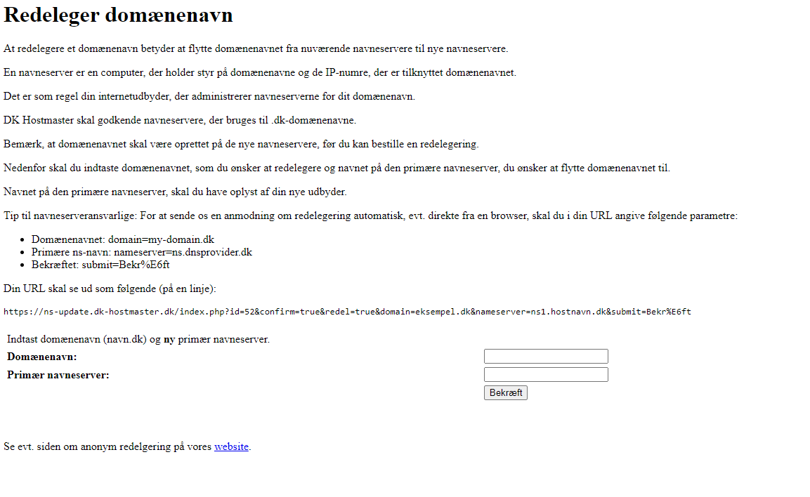
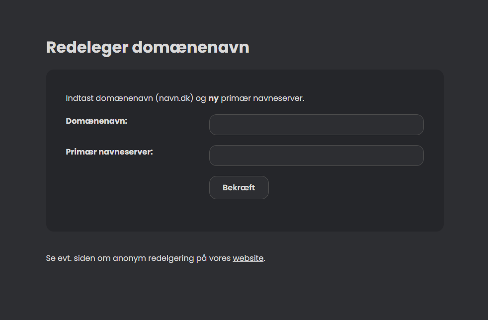

# Punktum DK NS Redelegering - Beautified

### Requirements

**Stylus Extension**
- [Chrome](https://chrome.google.com/webstore/detail/stylus/clngdbkpkpeebahjckkjfobafhncgmne)
- [Edge - Download from the Chrome Web Store](https://chrome.google.com/webstore/detail/stylus/clngdbkpkpeebahjckkjfobafhncgmne)
- [Firefox](https://addons.mozilla.org/en-US/firefox/addon/styl-us/)

### How to setup

**Create Stylus Style**

Go to [NS Update](https://ns-update.dk-hostmaster.dk/da), find the extension in your browser.
Select the following link to create a Style for that URL.

**CSS Styling**

Grab my CSS from [here](/styles.css) and insert it into your newly created style.

**Profit**

### Comparison
**Default**

**Updated**

